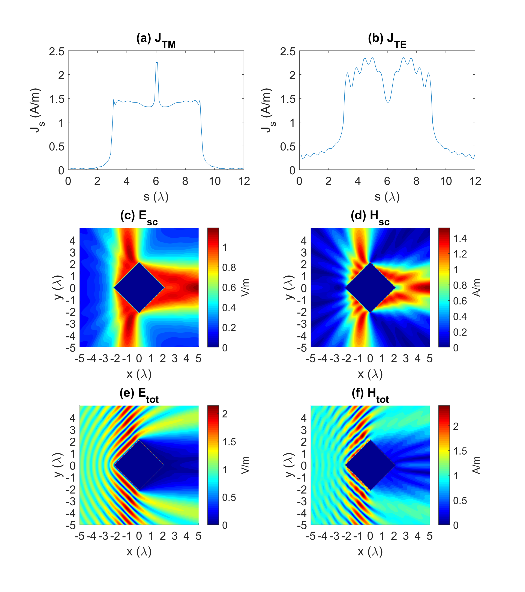

# Computational Electromagnetics: Infinitely Long Cylindrical Scatterer Implemented by the Method of Moment
 ECE540 Project III: Infinitely Long Conducting Cylindrical Scatterer with Various Incident Angles and Geometries Investigated by Moment Method
 
The method of moment (MoM) has been implemented to solve the scalar Helmholtz equations for an open-boundary scattering problem. The two-dimensional electromagnetic waves scattered by infinitely long conducting cylinders are studied. The impact of different incident angles and scatterer geometries on scattered and total fields are investigated. Technically, TM and TE polarization are considered by solving electric-field (EFIE) and magnetic-field (MFIE) integral equations, where Green's functions and its derivatives are expressed by the zeroth-order and first-order Hankel functions of the second kind, respectively. The results show that the impact of edge singularity and edge diffraction on surface current density have been captured for TM and TE cases. The objectives of this project are to (1) understand how to formulate EFIE and MFIE, (2) assemble individual segments of conducting cylinders into an interacting matrix, (3) solve the matrix to obtain surface current density, and finally (4) calculate the scattered and total fields contributed by the surface current of the conducting cylinders. 

  

